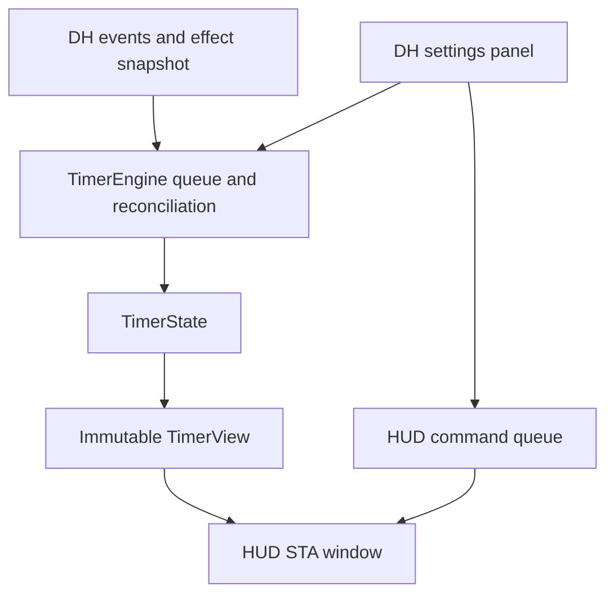

# Code architecture

## Components

All C# implementation files are under `src/`.

| File / type | Responsibility |
| --- | --- |
| `ReactionTimerPlugin.cs` / `ReactionTimerPlugin` | DH identity, initialization, termination, ownership of engine/UI/HUD |
| Same file / `TimerEngine` | SDK event queue, reconciliation, effect names, settings access, logging, immutable view publication |
| `TimerState.cs` | Pure countdown, pause, refresh, overlap and expiry state machine |
| `ReactionMatcher.cs` | Name/duration-based automatic reaction detection |
| `Settings.cs` | Defaults, validation, copies, JSON persistence and font input parsing |
| `ReactionTimerUi.cs` | Hosted control panel, icon, toolbar-aware width and HUD commands |
| `SettingsDialog.cs` | Settings, recent effect selection, numeric overrides and diagnostics export |
| `HudController.cs` | Dedicated STA thread and command queue |
| `HudWindow.cs` | Visibility, preview, movement, Z-order, capture affinity and rendering decisions |
| `NativeHud.cs` | Win32 declarations and disposable GDI/alpha-bitmap surface |
| `HudPresentation.cs` | Pure display text, monitor-relative positioning and monotonic re-spike alert state |

## State and time

Effect instance IDs identify active applications; definition IDs (DIDs) identify the kind of effect and key saved overrides. Do not interchange them. Automatic recognition requires a name containing spike and a known reaction or reaction keyword. Known nonpositive durations and durations over 30 seconds are excluded. A saved numeric override takes precedence over the automatic matcher.

The engine processes express, suppress, duration-update, login and logout events. Callbacks enqueue work rather than doing SDK queries or drawing. A 100 ms worker uses a lock with `TryEnter`, avoiding overlapping ticks; an approximately one-second scan reconciles the current active-effect set. The scan materializes the collection before pruning, so a failed enumeration does not erase known effects.

TimerState uses caller-supplied monotonic seconds. Repeated snapshots do not restart an existing effect. Explicit reapplication and duration updates can refresh an existing instance ID. Paused remaining time stays frozen; the newest relevant updated/applied entry wins when effects overlap. The alarm counter increments once when a previously active set has no live entry; repeated expired reads do not repeat the alarm.

Fresh express events with unavailable duration can use an explicitly estimated 12 seconds. Attaching to an already-running effect uses the SDK's calculated expiration, converting wall-clock expiry into remaining seconds; unknown timing stays unknown. A paused snapshot lacking reliable remaining time displays PAUSED. Character changes/logout clear stale state.

## Thread and resource ownership

The worker owns state under `_gate` and publishes a `TimerView` with `Volatile`. The HUD runs its own WinForms message loop on a background STA thread. Preview, Move and Stop cross through a concurrent command queue. Rendering reads an immutable view, while settings reads/saves use the engine lock. The hosted panel belongs to DH's UI thread.

The HUD uses a reusable top-down, premultiplied-alpha DIB. Drawing objects are disposed; the surface is recreated only when dimensions change. Normal rendering has transparent surroundings and an outline. Move temporarily changes hit testing and adds a drag hint. The HUD reasserts topmost positioning without focus and verifies `WDA_EXCLUDEFROMCAPTURE` after handle creation. Affinity acceptance is not proof of compatibility with every capture implementation.

When the view becomes Expired (including early removal of the last spike), a HUD-owned alert captures the configured duration. For that interval, text uses twice the saved font size and an opaque black background flashes on/off every half-second. Text remains visible and enlarged during both phases. Repeated expired views do not restart the alert; its end restores the ordinary transparent, normal-size RE-SPIKE message. A new spike or a non-expired state cancels it. Live alert time continues while hidden or previewing, preventing stale alerts from replaying on return. Preview uses separate state and includes the selected duration after its 12-second countdown. None of this modifies countdown state, saved font pixels, click-through behavior or capture exclusion.

Shutdown stops the engine timer, makes SDK callbacks inert, and queues the HUD thread's exit. HUD disposal is asynchronous; do not assume it has completed at the return of `HudController.Dispose`. This SDK does not expose the event-unregistration method the implementation would otherwise use.

## Persistence and diagnostics

`SettingsStore` writes `reaction-timer.json` in the folder supplied by DH, using a temporary file followed by replacement. Engine methods serialize writes. Defaults include font 28px, warning 2 seconds, re-spike visual alert 5 seconds, sound off, HUD enabled and normalized position (0.5, 0.72). Valid font input is 10–160. `RespikeAlertSeconds` is an integer from 0–60; 0 disables the alert immediately, and other duration changes apply to the next expiry. Existing settings without the field receive the 5-second default. Old `TextScalePercent` JSON is ignored while known effect mappings are retained.

Changing appearance increments the settings revision without resetting the timer; mapping changes reset recognition and request a scan. Drag positions are debounced. `reaction-timer.log` rotates after 256 KiB, with SDK/render errors throttled. `reaction-timer-effects.json` contains exported effect diagnostics and settings. The DH-supplied data directory is authoritative; do not assume it always equals the installation folder.

Agent counterpart: [Code map and invariants](../agents/CODE.md).
